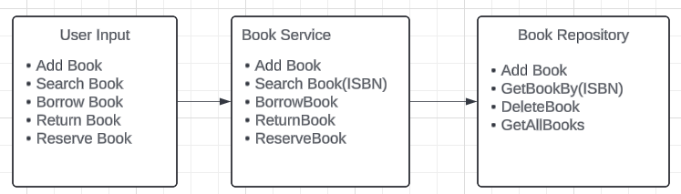

# Library Management System - Book Management System Design

## Overview
The Book Management system is a core component of the Library Management System, responsible for managing the library's book catalog. It handles operations such as adding, updating, deleting, and searching for books. It also manages the borrowing, returning, and reserving of books, ensuring that all relevant metadata, such as availability, borrowing, and overdue status, is accurately maintained.

## Flow Diagram


## Components

### 1. Book Class

**Purpose:**  
The `Book` class represents an individual book in the library. It includes all necessary attributes to manage the book's information and status, such as whether it is available, borrowed, or reserved.

**Attributes:**
- `ISBN` (string): The unique identifier for the book.
- `Title` (string): The title of the book.
- `Author` (string): The author of the book.
- `PublishedYear` (int): The year the book was published.
- `Genre` (string): The genre of the book.
- `IsAvailable` (bool): Indicates whether the book is available for borrowing or reservation.
- `IsBorrowed` (bool): Indicates whether the book is currently borrowed.
- `BorrowedByUser` (string?): The username of the user who borrowed the book.
- `ReservedByUser` (string?): The username of the user who reserved the book.

**Constructor:**
```csharp
public Book(string isbn, string title, string author, int publishedYear, string genre)
```

**Methods:**
- `Borrow(string username)`: Marks the book as borrowed by the specified user.
- `Return()`: Marks the book as returned, resetting its status.
- `Reserve(string username)`: Marks the book as reserved by the specified user.
- `CancelReservation(string username)`: Cancels the reservation made by the specified user.
- `UpdateBookInfo(string title, string author, int publishedYear, string genre)`: Updates the book's information.
- `ToString()`: Returns a string representation of the book, including its metadata.

### 2. BookRepository Class

**Purpose:**  
The `BookRepository` class acts as an in-memory data store for `Book` objects. It handles the storage, retrieval, and deletion of books from the catalog.

**Attributes:**
- `books` (Dictionary<string, Book>): A dictionary to store books by their ISBN for quick lookups.

**Methods:**
- `AddBook(Book book)`: Adds a new book to the repository.
- `GetBookByISBN(string isbn)`: Retrieves a book by its ISBN.
- `GetBooksByTitle(string title)`: Retrieves a list of books that match the given title.
- `GetBooksByAuthor(string author)`: Retrieves a list of books that match the given author.
- `GetAllBooks()`: Retrieves a list of all books in the repository.
- `DeleteBook(string isbn)`: Deletes a book from the repository.
- `UpdateBook(string isbn, string title, string author, int publishedYear, string genre)`: Updates the metadata of a book in the repository.

**Singleton Pattern:**
- The class follows the Singleton pattern to ensure only one instance of the repository exists, making it accessible globally within the application.

### 3. BookService Class

**Purpose:**  
The `BookService` class contains the business logic related to book management. It interacts with the `BookRepository` to perform operations such as adding, updating, deleting, borrowing, returning, and reserving books.

**Attributes:**
- `bookRepository` (BookRepository): The repository instance used for accessing book data.
- `userRepository` (UserRepository): The repository instance used for accessing user data, to verify permissions and login status.
- `_logger` (ILogger<BookService>): Logger for logging book-related activities.

**Methods:**
- `AddBook(string isbn, string title, string author, int publishedYear, string genre, string username)`: Adds a new book to the catalog, ensuring the user is authorized to do so.
- `SearchBookByTitle(string title, string username)`: Searches for books by title and displays the results, verifying the user's access.
- `SearchBookByAuthor(string author, string username)`: Searches for books by author and displays the results, verifying the user's access.
- `DisplayAllBooks(string username)`: Displays all books in the catalog, restricted to authorized users.
- `DeleteBook(string isbn, string username)`: Deletes a book from the catalog, restricted to authorized users.
- `UpdateBook(string isbn, string title, string author, int publishedYear, string genre, string username)`: Updates the metadata of a book, ensuring the user has the correct permissions.
- `BorrowBook(string isbn, string username)`: Allows a user to borrow a book, updating its status accordingly.
- `ReturnBook(string isbn, string username)`: Allows a user to return a borrowed book, updating its status accordingly.
- `ReserveBook(string isbn, string username)`: Allows a user to reserve a book, updating its status accordingly.
- `CancelReservation(string isbn, string username)`: Allows a user to cancel their reservation on a book.
- `DisplayAvailableBooks(string username)`: Displays all books that are currently available in the catalog.

**Logging:**
- The `BookService` class uses logging extensively to record the outcome of each operation (e.g., successful book addition, borrowing failures, etc.), which helps with debugging and auditing.

### 4. Metadata Management

**Purpose:**  
The system manages various aspects of book metadata, ensuring that all information is current and accurate. This includes tracking availability, borrowing status, reservation status, and overdue status.

**Key Areas:**
- **Availability Tracking:** Ensures that the system accurately reflects whether a book is available for borrowing or reservation.
- **Borrowing Status:** Tracks which books are borrowed, who borrowed them, and when.
- **Reservation Status:** Tracks which books are reserved and by whom.
- **Overdue Status:** Calculates whether a borrowed book is overdue and by how many days, allowing for fine calculations.

### Book Management Flow

1. **Adding a Book:**
   - The user must be logged in and have appropriate staff privileges.
   - The system checks if a book with the same ISBN already exists.
   - If not, the book is added to the repository, and a success message is logged.

2. **Updating a Book:**
   - The user must be logged in and have appropriate staff privileges.
   - The system checks if the book exists before updating its metadata.
   - The book’s information is updated, and a success message is logged.

3. **Deleting a Book:**
   - The user must be logged in and have appropriate staff privileges.
   - The system checks if the book exists before deleting it.
   - The book is removed from the repository, and a success message is logged.

4. **Borrowing a Book:**
   - The user must be logged in.
   - The system checks if the book is available for borrowing.
   - If available, the book’s status is updated, and it is marked as borrowed by the user.

5. **Returning a Book:**
   - The user must be logged in.
   - The system checks if the book is currently borrowed.
   - If borrowed, the book’s status is updated, and it is marked as returned.

6. **Reserving a Book:**
   - The user must be logged in.
   - The system checks if the book is available for reservation.
   - If available, the book’s status is updated, and it is marked as reserved by the user.

7. **Displaying Books:**
   - The system can display all books, books by title, books by author, or only available books, depending on the user’s input.

### Security Considerations

- **Permission Checks:**  
  Only authorized users (e.g., staff members) are allowed to add, update, or delete books from the catalog.

- **Concurrency:**  
  The system should be designed to handle concurrent updates to book metadata, ensuring that multiple users can interact with the system without causing inconsistencies.

- **Input Validation:**  
  All input should be validated to ensure that book data is accurate and complete before it is added to the repository.

### Error Handling

- **Book Not Found:**  
  The system provides feedback if a user attempts to interact with a book that does not exist in the catalog.

- **Unavailable Book:**  
  The system informs the user if a book is already borrowed or reserved when they attempt to borrow or reserve it.

- **Metadata Updates:**  
  The system handles failures in updating metadata by logging errors and ensuring that any issues are addressed.

## Conclusion

The book management system is designed to be comprehensive, handling all aspects of managing a library's book catalog. It is built with flexibility, security, and user accessibility in mind, ensuring that the system can scale and adapt to the needs of the library. The design can be expanded or enhanced with additional features, such as integration with external databases or more complex metadata management, as needed.