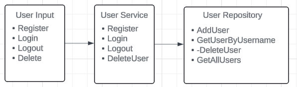

# Library Management System - User Authentication System Design

## Overview
The User Authentication system in the Library Management System is responsible for managing user-related operations, including registration, login, logout, and account deletion. This ensures that only authenticated users can access and interact with the library's resources. The system is designed to be simple yet effective, with clear separations between data storage, business logic, and user interaction.

## Flow Diagram



## Components

### 1. User Class

**Purpose:**  
The `User` class represents a user in the system and holds essential information such as the username, password, email, login status, and role.

**Attributes:**
- `Username` (string): The unique identifier for the user.
- `Password` (string): The user's password (stored as plain text in this design for simplicity, though it should be hashed in a real system).
- `Email` (string): The user's email address.
- `IsLoggedIn` (bool): Indicates whether the user is currently logged in.
- `Role` (Role enum): Represents the user's role in the system (e.g., USER, ADMIN).

**Constructor:**
```csharp
public User(string username, string password, string email, Role role)
```

**Methods:**
- No additional methods are required; this class is primarily a data container.

### 2. UserRepository Class

**Purpose:**  
The `UserRepository` class acts as a simple in-memory data store for `User` objects. It handles the storage, retrieval, and deletion of user data.

**Attributes:**
- `users` (Dictionary<string, User>): A dictionary to store users by their username, enabling quick lookups.

**Methods:**
- `AddUser(User user)`: Adds a new user to the repository.
- `GetUserByUsername(string username)`: Retrieves a user by their username.
- `DeleteUser(string username)`: Deletes a user from the repository.
- `GetAllUsers()`: Retrieves a list of all users.
- `IsUserLoggedIn(string username)`: Checks if a user exists and is currently logged in.

**Singleton Pattern:**
- The class follows the Singleton pattern to ensure only one instance of the repository exists, making it accessible globally within the application.

### 3. UserService Class

**Purpose:**  
The `UserService` class contains the business logic related to user management. It interacts with the `UserRepository` to perform operations like registration, login, logout, and deletion of users.

**Attributes:**
- `userRepository` (UserRepository): The repository instance used for accessing user data.
- `_logger` (ILogger<UserService>): Logger for logging user-related activities.

**Methods:**
- `Register(string username, string password, string email, Role role = Role.USER)`: Registers a new user. Checks if the username already exists; if not, it adds the user to the repository.
- `Login(string username, string password)`: Authenticates a user by verifying their username and password. If successful, sets the `IsLoggedIn` status to `true`.
- `Logout(string username)`: Logs out a user by setting their `IsLoggedIn` status to `false`.
- `DeleteUser(string username)`: Deletes a user from the system.
- `DisplayAllUsers()`: Displays all registered users and their details.

**Logging:**
- The `UserService` class uses logging extensively to record the outcome of each operation (e.g., successful registration, login failures, etc.), which helps with debugging and auditing.

### User Authentication Flow

1. **User Registration:**
   - The user enters their username, password, and email.
   - The system checks if the username is already taken.
   - If not, the user is added to the repository, and a success message is logged.

2. **User Login:**
   - The user enters their username and password.
   - The system verifies the credentials.
   - If valid, the user's `IsLoggedIn` status is set to `true`, and a success message is logged.

3. **User Logout:**
   - The system checks if the user is logged in.
   - If they are, their `IsLoggedIn` status is set to `false`, and a success message is logged.

4. **Account Deletion:**
   - The system retrieves the user by username.
   - If the user exists, they are removed from the repository, and a success message is logged.

## Security Considerations

- **Password Storage:**  
  In this design, passwords are stored as plain text. In a real-world application, passwords should be hashed and salted to ensure security.

- **Session Management:**  
  While this basic design uses a boolean `IsLoggedIn` flag for session management, a more secure implementation would involve session tokens or cookies to handle user sessions.

- **Input Validation:**  
  The design should incorporate additional checks to prevent issues like SQL injection (if connected to a database) and ensure that user inputs are valid and secure.

## Error Handling

- **User Already Exists:**  
  The system provides feedback if a user attempts to register with an existing username.

- **Invalid Login:**  
  The system informs the user if their login credentials are incorrect.

## Conclusion

This user authentication system is designed to be simple, focusing on the core functionalities required for managing users in a library management system. The design can be expanded or enhanced with additional security features, error handling, and scalability considerations as needed.